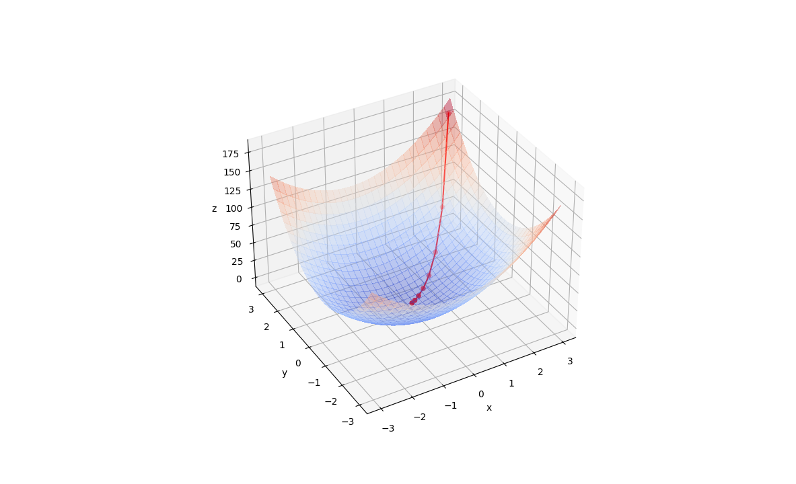

<h1 align="center"><a href="https://en.wikipedia.org/wiki/Gradient_descent">
Gradient Descent</a> Visualizer</h1>

  

  

******

## Overview

Simple visualizer of what gradient descent actually means.  
At this moment prepared for 3D graphs, but there will also be a 2D version.

Written in `python 3.9`, but any version supporting `typing` will be fine.

****
### Install requirements:  
`pip install -r requirements.txt`  

****

### Run visualization:  
`make run`

### Run tests:
`make tests`