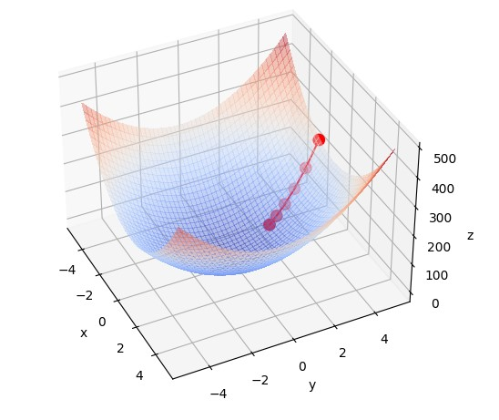

# [Gradient Descent](https://en.wikipedia.org/wiki/Gradient_descent) Visualizer

  

Simple visualizer of what gradient descent actually means.  
At this moment prepared for 3D graphs, but there will also be a 2D version.  

Install requirements with:  
`pip install -r requirements.txt`